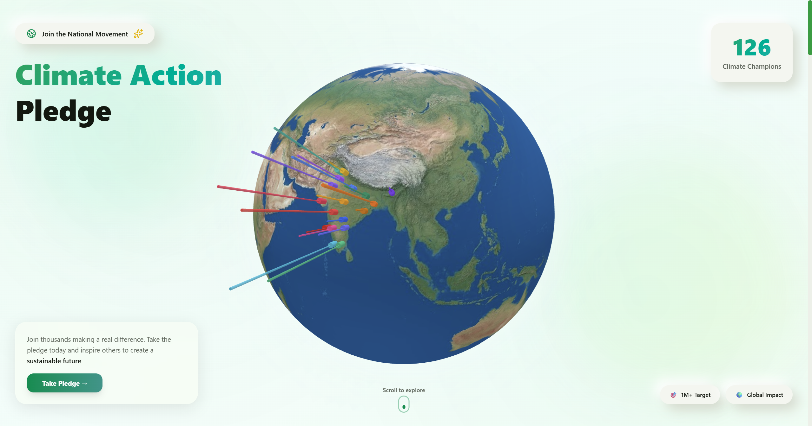
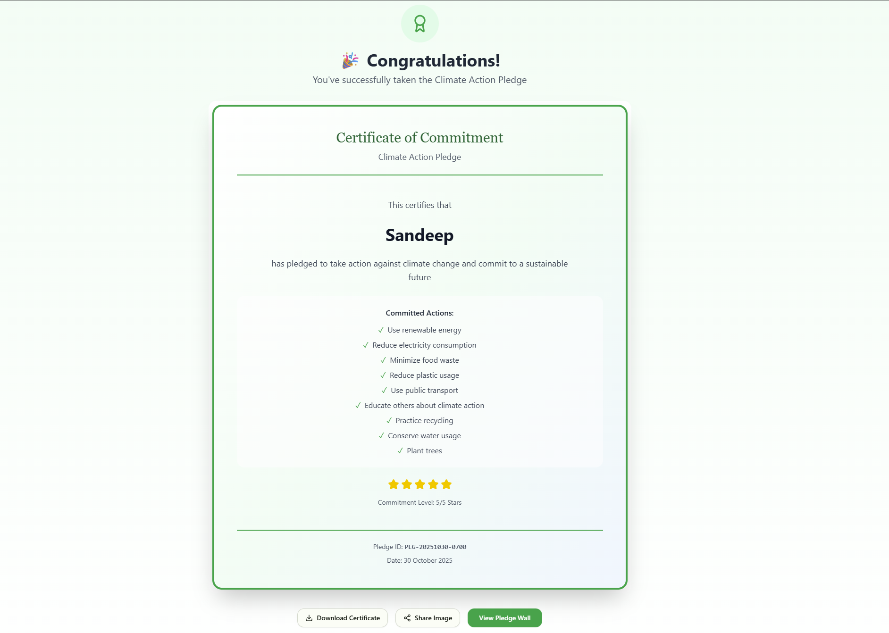

# 🌍 Climate Action Pledge

<div align="center">

[](https://nextjs.org/)
[](https://www.typescriptlang.org/)
[](https://tailwindcss.com/)
[](LICENSE)

*A modern, interactive web application for climate action pledges featuring an immersive 3D globe, AI-powered certificates, and real-time pledge tracking.*

[Live Demo](https://climate-action-pledge-swart.vercel.app/) • [Documentation](https://github.com/Sandeep-Surya/climate-action-pledge) • [Features](#-features) • [Installation](#-getting-started)

</div>

---

<p align="center">
   
   <br/>
   <em>Landing hero section with interactive 3D globe</em>
</p>

## ✨ Features

<table>
<tr>
<td width="50%">

### 🌐 Interactive 3D Globe
- Real-time visualization of pledges across India
- State-wise distribution with height-mapped data
- Smooth animations and hover interactions
- Dynamic color-coded intensity mapping

</td>
<td width="50%">

### 📝 Multi-Step Pledge Form
- Intuitive 3-step form with progress tracking
- Real-time validation with helpful feedback
- Privacy-first design with data protection
- Auto-calculated commitment ratings

</td>
</tr>
<tr>
<td width="50%">

### 🏆 Personalized Certificates
- Auto-generated certificates
- Unique pledge IDs and timestamps
- Star rating visualization
- Download & social sharing support

</td>
<td width="50%">

### 📊 Live Dashboard & KPI Tracking
- Real-time pledge statistics
- 1,000,000 pledge target visualization
- Regional performance metrics
- Live update polling (30-second intervals)

</td>
</tr>
<tr>
<td width="50%">

### 🎨 Modern UI/UX Design
- Neo-morphism & glass-morphism effects
- Smooth 60fps animations
- Fully responsive (mobile, tablet, desktop)
- Accessibility-first approach

</td>
<td width="50%">

### 💾 Data Persistence
- Google Sheets API integration
- Automatic data backup
- Fallback to local storage
- Real-time sync capabilities

</td>
</tr>
</table>

## 🛠 Technology Stack

<div align="center">

| Category | Technologies |
|----------|---------------|
| **Frontend Framework** | [Next.js 16](https://nextjs.org/) (App Router) |
| **Language** | [TypeScript 5.x](https://www.typescriptlang.org/) |
| **Styling** | [Tailwind CSS v4](https://tailwindcss.com/) |
| **UI Components** | [shadcn/ui](https://ui.shadcn.com/) (Radix UI) |
| **3D Visualization** | [Three.js](https://threejs.org/) + [react-globe.gl](https://github.com/vasturiano/react-globe.gl) |
| **Animations** | [Framer Motion](https://www.framer.com/motion/) |
| **Database** | [Google Sheets API](https://developers.google.com/sheets/api) |
| **Icons** | [Lucide React](https://lucide.dev/) |
| **Utilities** | Clsx, Lenis (smooth scrolling) |

</div>

## 🚀 Getting Started

### Prerequisites

- **Node.js** 18+ ([Download](https://nodejs.org/))
- **npm** or **yarn** package manager
- Git

### Installation

1. **Clone the repository**
   ```bash
   git clone https://github.com/Sandeep-Surya/climate-action-pledge.git
   cd climate-action-pledge
   ```

2. **Install dependencies**
   ```bash
   npm install
   # or
   yarn install
   ```

3. **Start development server**
   ```bash
   npm run dev
   # or
   yarn dev
   ```

4. **Open in browser**
   Visit [http://localhost:3000](http://localhost:3000)

### Available Scripts

```bash
npm run dev        # 🚀 Start development server (hot reload)
npm run build      # 📦 Build for production
npm start          # ▶️  Start production server
npm run lint       # 🔍 Run ESLint checks
npm run type-check # ✅ TypeScript type checking
npm run clean      # 🧹 Remove build artifacts
```

## ⚙️ Environment Configuration

To enable Google Sheets integration for persistent data storage, create a `.env.local` file:

```env
GOOGLE_SHEETS_PRIVATE_KEY=<your-service-account-private-key>
GOOGLE_SHEETS_CLIENT_EMAIL=<your-service-account-email>
GOOGLE_SHEET_ID=<your-spreadsheet-id>
```

**Without configuration:** The app uses in-memory storage (data resets on server restart).

**With configuration:** All pledges are automatically saved to your Google Sheet.

See [`env.example`](env.example) for reference.

## 📁 Project Structure

```
climate-action-pledge/
├── 📂 app/                              # Next.js app directory
│   ├── actions/
│   │   └── pledge.ts                    # Server-side pledge operations
│   ├── layout.tsx                       # Root layout with metadata
│   ├── page.tsx                         # Main application page
│   └── globals.css                      # Global styles & animations
│
├── 📂 components/                       # React components (feature-based)
│   ├── Certificate.tsx                  # Certificate display & download
│   ├── Globe3D.tsx                      # 3D interactive globe
│   ├── HeroSection.tsx                  # Landing hero section
│   ├── KPISectionNew.tsx                # KPI metrics dashboard
│   ├── PledgeFormEnhanced.tsx           # 3-step pledge form
│   ├── PledgeWallNew.tsx                # Public pledge showcase
│   ├── SuccessSplash.tsx                # Success animation screen
│   ├── WhySectionTabbed.tsx             # Educational content
│   └── ui/                              # shadcn/ui components
│       ├── badge.tsx
│       ├── button.tsx
│       ├── card.tsx
│       ├── input.tsx
│       ├── label.tsx
│       ├── select.tsx
│       ├── tabs.tsx
│       └── textarea.tsx
│
├── 📂 lib/                              # Utility functions
│   ├── googleSheets.ts                  # Google Sheets API wrapper
│   ├── mockData.ts                      # Mock data store
│   └── utils.ts                         # Helper utilities
│
├── 📂 types/                            # TypeScript type definitions
│   └── pledge.ts                        # Pledge types & constants
│
├── 📂 public/                           # Static assets
│   └── images/
│       ├── screenshots/                 # Feature screenshots
│       └── quotes/                      # Climate activist images
│
├── 📋 Configuration Files
│   ├── components.json                  # shadcn/ui config
│   ├── next.config.ts                   # Next.js configuration
│   ├── tailwind.config.mjs              # Tailwind CSS configuration
│   ├── tsconfig.json                    # TypeScript configuration
│   ├── eslint.config.mjs                # ESLint rules
│   ├── postcss.config.mjs               # PostCSS plugins
│   └── vercel.json                      # Vercel deployment config
│
└── 📦 package.json                      # Dependencies & scripts
```
7. **Micro-interactions**: Subtle animations on hover, focus, and click
8. **Environmental Color Psychology**: Nature-inspired palette evoking sustainability

### 🌐 Interactive Elements
- **3D Globe**: Real-time demographic visualization with WebGL
- **Multi-step Forms**: Progress-tracked, validated form experience
- **Animated Transitions**: Smooth page-to-page animations
- **Hover States**: Rich feedback on all interactive elements

### ⚡ Performance Optimizations
- **Dynamic Imports**: Lazy loading of 3D globe component
- **Hardware Acceleration**: CSS transforms with will-change
- **Code Splitting**: Optimized bundle sizes
- **Image Optimization**: Next.js automatic image optimization
- **Font Display Swap**: Fast text rendering with web fonts

### ♿ Accessibility
- Semantic HTML structure
- ARIA labels on form fields
- Keyboard navigation support
- Screen reader compatibility
- High contrast ratios for readability

## 🚢 Deployment

### Deploy on Vercel (Recommended)

The easiest way to deploy is with [Vercel](https://vercel.com/):

1. **Via GitHub Integration**
   - Push code to GitHub
   - Connect repo to Vercel dashboard
   - Auto-deploy on every push

2. **Via Vercel CLI**
   ```bash
   npm install -g vercel
   vercel
   ```

3. **Environment Variables**
   - Set `GOOGLE_SHEETS_*` variables in Vercel dashboard
   - Or use `.env.production.local` locally

**Configuration**: See [`vercel.json`](vercel.json) for pre-configured settings.

### Deploy Anywhere

Next.js can run on any Node.js server:

```bash
npm run build
npm run start
```

Visit [Next.js Deployment Docs](https://nextjs.org/docs/app/building-your-application/deploying) for more.

## 🎨 Design System

### Design Philosophy
- **Environmental Authenticity**: Light, nature-inspired color palette
- **Engagement**: Interactive 3D elements and kinetic typography
- **Performance**: Smooth 60fps animations with hardware acceleration
- **Accessibility**: WCAG 2.1 AA compliance throughout
- **Modern Trends**: Neo-morphism, glass-morphism, liquid animations

### Color Palette
- **Primary Green**: `#059669` - Trust and sustainability
- **Teal Accents**: `#14b8a6` - Water and climate
- **Earth Tones**: `#6b7280` - Natural, grounded feel
- **Light Backgrounds**: `#f0fdf4` - Emerald-50 for reduced strain

### Typography
- **Display**: [Syne](https://fonts.google.com/specimen/Syne) - Bold & Modern
- **Headings**: [Poppins](https://fonts.google.com/specimen/Poppins) - Clear hierarchy
- **Accents**: [Space Grotesk](https://fonts.google.com/specimen/Space+Grotesk) - Technical feel
- **Body**: [Inter](https://fonts.google.com/specimen/Inter) - Excellent readability

## ⚡ Performance Metrics

<div align="center">

| Metric | Target | Status |
|--------|--------|--------|
| **First Contentful Paint** | < 1.5s | ✅ |
| **Time to Interactive** | < 3.5s | ✅ |
| **Cumulative Layout Shift** | < 0.1 | ✅ |
| **Frame Rate** | 60 FPS | ✅ |
| **Bundle Size** | < 500KB | ✅ |
| **Mobile Lighthouse** | 90+ | ✅ |

</div>

## License

MIT License - see [LICENSE](LICENSE) file for details.

## 📸 Screenshots

<table>
<tr>
<td align="center" width="50%">
<strong>Hero Section with 3D Globe</strong><br/>

</td>
<td align="center" width="50%">
<strong>Pledge Wall</strong><br/>

</td>
</tr>
<tr>
<td align="center" width="50%">
<strong>Generated Certificate</strong><br/>

</td>
<td align="center" width="50%">
<strong>Success Confirmation</strong><br/>

</td>
</tr>
</table>


## 📖 Documentation

- [Component Architecture](./docs/ARCHITECTURE.md) - Component design patterns
- [API Reference](./docs/API.md) - Server actions & utilities
- [Styling Guide](./docs/STYLING.md) - Design tokens & theme
- [Contributing Guide](./CONTRIBUTING.md) - How to contribute

## 🤝 Contributing

Contributions are welcome! To contribute:

1. Fork the repository
2. Create a feature branch (`git checkout -b feature/amazing-feature`)
3. Commit changes (`git commit -m 'Add amazing feature'`)
4. Push to branch (`git push origin feature/amazing-feature`)
5. Open a Pull Request

Please ensure:
- Code follows ESLint rules (`npm run lint`)
- TypeScript types are correct (`npm run type-check`)
- Components are documented
- Changes are tested

## 🐛 Issues & Support

Found a bug? Have a feature request? [Open an issue](https://github.com/Sandeep-Surya/climate-action-pledge/issues)

For questions or support, reach out via:
- Email: mailtosandeepsurya@gmail.com
- Discussions: GitHub Discussions
- Linkedin: https://www.linkedin.com/in/surya-ls
---

<div align="center">

## 📄 License

This project is licensed under the **MIT License** - see the [LICENSE](LICENSE) file for details.

## ⭐ Show Your Support

If this project helps you, please consider giving it a star! It helps others discover the project.

---

<div>

**Version 1.0.0** • Built with ❤️ for climate action • 🌱 Making a difference, one pledge at a time

Made with [Next.js](https://nextjs.org/) • Styled with [Tailwind CSS](https://tailwindcss.com/) • 3D with [Three.js](https://threejs.org/)

© 2025 Climate Action Pledge. All rights reserved.

</div>

</div>
